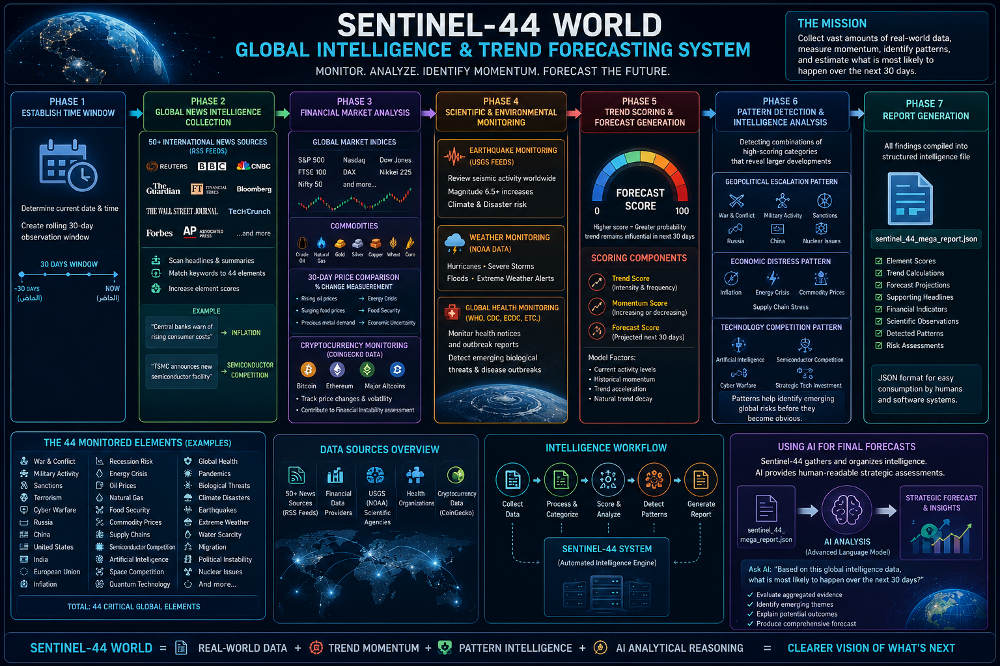

Sentinel-44 World: Global Intelligence & Trend Forecasting System

The Big Picture: What Is Sentinel-44 World?

Sentinel-44 World is a large-scale global intelligence aggregation system designed to monitor, analyze, and forecast major world developments.

Rather than attempting to predict the future using complex artificial intelligence models alone, Sentinel-44 relies on a proven principle: trend momentum. When governments, financial markets, scientific organizations, and major news outlets repeatedly focus on the same subjects over a sustained period, those subjects often continue influencing global events in the near future.

The system continuously monitors 44 critical global elements, including:

- War & Conflict
- Inflation
- Cyber Warfare
- Food Security
- Energy Crisis
- Artificial Intelligence Competition
- Global Health
- Climate Disasters
- Supply Chains
- Semiconductor Competition
- Regional Powers such as India, China, Russia, and the United States

Its objective is simple: collect vast amounts of real-world data, measure momentum, identify patterns, and estimate what is most likely to happen over the next 30 days.

# Sentinel-44 World

How Sentinel-44 Works

Phase 1: Establishing the Time Window

The system begins by determining the current date and time.

A rolling 30-day observation window is created, ensuring that only recent and relevant information is analyzed. Older data is excluded to maintain accuracy and responsiveness to current events.

---

Phase 2: Global News Intelligence Collection

Sentinel-44 gathers information from more than 50 international news sources through RSS feeds.

These sources include:

- Reuters
- BBC
- CNBC
- The Guardian
- Financial publications
- Aerospace publications
- Mining and commodity sources
- Science and technology outlets
- Geopolitical intelligence sources

RSS feeds provide lightweight access to the latest headlines and article summaries.

As each article is processed, the system scans for predefined keywords associated with the 44 monitored elements.

Example

Headline:

«"Central banks warn of rising consumer costs"»

Keywords such as "costs" and "consumer prices" contribute to the Inflation category.

Headline:

«"TSMC announces new semiconductor facility"»

Keywords such as "semiconductor," "microchip," and "fabrication" contribute to the Semiconductor Competition category.

Each relevant mention increases the score of its associated element.

---

Phase 3: Financial Market Analysis

News reflects public discussion, but financial markets reflect real-world capital movement.

Sentinel-44 connects to financial data providers and retrieves:

Global Market Indices

- S&P 500
- Nasdaq
- Dow Jones
- FTSE 100
- DAX
- Nikkei 225
- Nifty 50
- Additional global exchanges

Commodities

- Crude Oil
- Natural Gas
- Gold
- Silver
- Copper
- Wheat
- Corn

The system compares current prices with prices from 30 days earlier and measures percentage changes.

Significant movements influence related categories:

- Rising oil prices increase Energy Crisis risk.
- Surging food commodities raise Food Security concerns.
- Precious metal demand may indicate economic uncertainty.

Cryptocurrency Monitoring

Sentinel-44 also analyzes cryptocurrency markets through CoinGecko data.

It tracks:

- Bitcoin
- Ethereum
- Major alternative cryptocurrencies

Large market volatility contributes to financial instability and risk assessments.

---

Phase 4: Scientific and Environmental Monitoring

The system continuously gathers data from trusted scientific organizations and government databases.

Earthquake Monitoring

Using USGS earthquake feeds, Sentinel-44 reviews seismic activity worldwide.

Major earthquakes, particularly those above magnitude 6.5, contribute to the Climate & Disaster category.

Weather Monitoring

NOAA weather data is analyzed for:

- Hurricanes
- Severe storms
- Floods
- Extreme weather alerts

Global Health Monitoring

Health notices and outbreak reports from international health organizations are reviewed for signs of emerging biological threats or disease outbreaks.

---

Phase 5: Trend Scoring and Forecast Generation

After data collection is complete, Sentinel-44 calculates scores for all 44 monitored elements.

Each element receives:

Trend Score

Measures the intensity and frequency of recent activity.

Momentum Score

Measures whether attention toward a topic is increasing or decreasing.

Forecast Score

Projects the likely strength of the trend over the next 30 days.

The forecast model applies:

- Current activity levels
- Historical momentum
- Trend acceleration
- Natural trend decay factors

The result is a forecast score ranging from 0 to 100.

Higher scores indicate a greater probability that the trend will remain influential during the upcoming month.

---

Phase 6: Pattern Detection and Intelligence Analysis

Individual trends are valuable, but combinations of trends often reveal larger developments.

Sentinel-44 searches for meaningful relationships among high-scoring categories.

Geopolitical Escalation Pattern

Triggered when categories such as:

- War & Conflict
- Military Activity
- Sanctions
- Russia
- China
- Nuclear Issues

simultaneously display elevated scores.

Economic Distress Pattern

Triggered when:

- Inflation
- Energy Crisis
- Commodity Prices
- Supply Chain Stress

rise together.

Technology Competition Pattern

Triggered when:

- Artificial Intelligence
- Semiconductor Competition
- Cyber Warfare
- Strategic Technology Investment

show strong synchronized growth.

These combinations help identify emerging global risks before they become obvious.

---

Phase 7: Report Generation

Once analysis is complete, all findings are compiled into a structured file:

sentinel_44_mega_report.json

The report contains:

- Element scores
- Trend calculations
- Forecast projections
- Supporting headlines
- Financial indicators
- Scientific observations
- Detected patterns
- Risk assessments

JSON format allows both humans and software systems to easily consume and analyze the information.

---

Using Artificial Intelligence for Final Forecasts

Sentinel-44 is designed to gather and organize intelligence. It identifies patterns and measures momentum, but it does not generate detailed narrative forecasts on its own.

To produce human-readable strategic assessments, the generated JSON report can be analyzed by an advanced AI system.

After Sentinel-44 creates the report, simply provide the JSON data to an AI model and ask:

«Based on this global intelligence data, what is most likely to happen over the next 30 days?»

The AI can then evaluate the aggregated evidence, identify emerging themes, explain potential outcomes, and produce a comprehensive forecast grounded in the collected data.

The result is a structured intelligence workflow that combines large-scale automated data collection with advanced analytical reasoning, providing a powerful tool for monitoring global developments and anticipating short-term trends.
